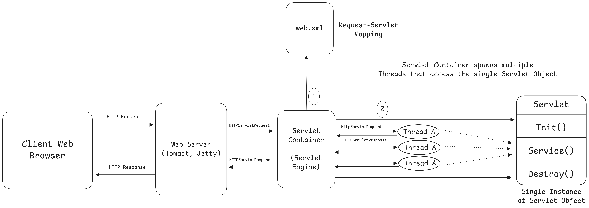
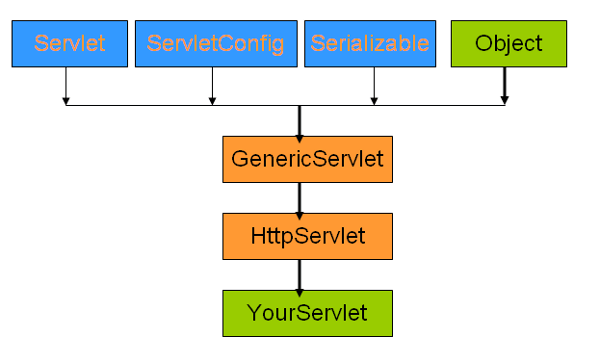

**Q: What is a Servlet? Explain how a servlet is processed.**

**Answer:**

A **Servlet** is a Java class used to build web applications. It runs on a web server and handles client requests and responses, typically over HTTP. It is a part of the **Jakarta Servlet API (formerly Java Servlet API)** and is used to create dynamic content, like generating HTML based on user input or interacting with databases.

### How a Servlet is Processed (Servlet Life Cycle):

The servlet life cycle is managed by the **Servlet container** (like Apache Tomcat or Jetty), and it involves **three main stages**:

1. **Initialization (`init()` method):**

   * This happens only once when the servlet is first loaded.
   * The servlet container calls the `init()` method to initialize resources (like DB connections or config files).

2. **Request Handling (`service()` method):**

   * Every time a client (usually a browser) sends a request, the servlet container calls the `service()` method.
   * The `service()` method checks the request type (GET, POST, etc.) and calls the appropriate method: `doGet()`, `doPost()`, etc.
   * This is where the main logic of the servlet goes—processing input, calling business logic, and generating a response (like HTML or JSON).

3. **Destruction (`destroy()` method):**

   * When the server shuts down or the servlet is no longer needed, the `destroy()` method is called.
   * It cleans up resources like closing DB connections or stopping threads.

### Example Workflow:

* User sends a request to a servlet by visiting `http://example.com/HelloServlet`.
* The servlet container checks if the servlet is already loaded. If not, it loads it and calls `init()`.
* Then it calls `service()`, which in turn calls `doGet()` or `doPost()` depending on the request.
* The servlet processes the request and sends back a response (like a dynamic HTML page).
* When the servlet is no longer needed, `destroy()` is called.




---
## Q: Can we modify the init(), service() or destroy() method of servlet?

Yes, we can modify the `init()`, `service()`, and `destroy()` methods of a servlet, and in fact, it’s quite common to do so depending on the servlet’s purpose.

### 1. `init()` method:

* This method is called once when the servlet is first loaded by the container.
* We can override it to perform initialization tasks like setting up database connections, reading configuration files, or allocating resources.
* It's important to call `super.init(config)` if we override the version that takes a `ServletConfig` parameter.

### 2. `service()` method:

* This method handles all client requests and routes them to the appropriate method based on the HTTP request type (like `doGet()`, `doPost()`, etc.).
* While we **can** override `service()`, it's more common to override `doGet()` or `doPost()` directly.
* Overriding `service()` is useful if we want custom logic for handling all request types in a uniform way.

### 3. `destroy()` method:

* This method is called once before the servlet is unloaded.
* We typically override it to release resources like closing database connections, stopping background threads, or cleaning up temporary files.

```java
import javax.servlet.*;
import javax.servlet.http.*;
import java.io.*;
import java.sql.*;

public class MyHttpServlet extends HttpServlet {

    private Connection connection;

    @Override
    public void init() throws ServletException {
        // Initialization logic (e.g., setting up JDBC connection)
        try {
            // Example: Establish a JDBC connection
            Class.forName("com.mysql.cj.jdbc.Driver");
            String url = "jdbc:mysql://localhost:3306/mydb";
            String username = "root";
            String password = "password";
            connection = DriverManager.getConnection(url, username, password);
            System.out.println("JDBC connection initialized.");
        } catch (SQLException | ClassNotFoundException e) {
            throw new ServletException("Unable to establish JDBC connection", e);
        }
    }

    @Override
    public void service(HttpServletRequest request, HttpServletResponse response) throws ServletException, IOException {
        // Custom request handling logic (called for each request)
        String method = request.getMethod();
        if ("GET".equals(method)) {
            doGet(request, response);
        } else if ("POST".equals(method)) {
            doPost(request, response);
        } else {
            response.sendError(HttpServletResponse.SC_METHOD_NOT_ALLOWED);
        }
    }

    @Override
    protected void doGet(HttpServletRequest request, HttpServletResponse response) throws ServletException, IOException {
        // Handle GET request (override as needed)
        response.setContentType("text/html");
        PrintWriter out = response.getWriter();
        out.println("<h1>GET Request Handled</h1>");
    }

    @Override
    protected void doPost(HttpServletRequest request, HttpServletResponse response) throws ServletException, IOException {
        // Handle POST request (override as needed)
        String username = request.getParameter("username");
        response.setContentType("text/html");
        PrintWriter out = response.getWriter();
        out.println("<h1>POST Request Handled</h1>");
        out.println("<p>Username: " + username + "</p>");
    }

    @Override
    public void destroy() {
        // Cleanup resources (e.g., closing JDBC connection)
        try {
            if (connection != null && !connection.isClosed()) {
                connection.close();
                System.out.println("JDBC connection closed.");
            }
        } catch (SQLException e) {
            System.out.println("Error closing JDBC connection: " + e.getMessage());
        }
    }
}

```

---

**Q: Write a Java Servlet which will display “welcome to Servlet” message.**

Look at `Servlet Example 1` in Repository

---

**Q: Write a servlet which will accept user's name and password in a form, which will compare both in the database to display success or failure.**

Look at `Servlet Example 2` in Repository

---

**Q: What is and why is session management is required in Servlet?**

Session management is the process of tracking a user's interaction with a web application across multiple requests. Since HTTP is a stateless protocol, each request from a client to a server is treated as independent, with no memory of previous interactions.

Servlets use session management to maintain user-specific data (like login status, cart contents, or preferences) across multiple pages during a visit to a website.

Why is Session Management Required?

Without session management, the server would treat every request as coming from a new user. This means:
- A user would have to log in on every page.
- You couldn't maintain shopping carts, form progress, or user preferences.
- There would be no way to differentiate between users accessing the application simultaneously.

Session management enables features like:
- Login/logout
- Shopping cart in e-commerce sites
- User profile access
- Secure user actions (like viewing orders, performing transactions)

Servlets offer multiple ways to manage sessions:

1. Cookies
A small piece of data stored on the client side (browser).
```java
Cookie cookie = new Cookie("user", "John");
response.addCookie(cookie);
```

2. HttpSession Object (Most Common in Servlets)
Provided by the Servlet API to store and retrieve user-specific data
It is created automatically or manually and can be used as:
```java
HttpSession session = request.getSession();
session.setAttribute("username", "John");
String user = (String) session.getAttribute("username");
```

3. URL Rewriting
URL Rewriting means appending data (usually session ID or user info) to the URL itself so it can be passed between client and server.
```java
String url = response.encodeURL("dashboard.jsp");
```

4. Hidden Form Fields 
Data is stored in a hidden input field in a form and submitted with each request.
```html
<input type="hidden" name="sessionId" value="12345">
```

---

**Q: Create a servlet in java to get user ID and password parameters which are entered in the form of Login.html file.**

```html
<!DOCTYPE html>
<html>
<head>
    <title>Login Page</title>
</head>
<body>
    <h2>Login</h2>
    <form action="login" method="post">
        <label for="userID">User ID:</label>
        <input type="text" id="userID" name="userID"><br><br>

        <label for="password">Password:</label>
        <input type="password" id="password" name="password"><br><br>

        <input type="submit" value="Login">
    </form>
</body>
</html>
```
Servlet:
```java
import javax.servlet.*;
import javax.servlet.http.*;
import java.io.*;

public class LoginServlet extends HttpServlet {
    @Override
    protected void doPost(HttpServletRequest request, HttpServletResponse response)
            throws ServletException, IOException {
        
        response.setContentType("text/html");
        PrintWriter out = response.getWriter();

        // Retrieve form data
        String userID = request.getParameter("userID");
        String password = request.getParameter("password");

        // Output received data
        out.println("<html><body>");
        out.println("<h2>Login Details Received</h2>");
        out.println("<p>User ID: " + userID + "</p>");
        out.println("<p>Password: " + password + "</p>");
        out.println("</body></html>");
    }
}
```
---
**What is thread safety in Servlets? Write a Servlet which will display the count of number of times a client has accessed it.**

Thread safety in Servlets refers to the ability of a servlet to handle multiple concurrent requests from different users without data corruption or unexpected behavior.

Servlet containers (like Tomcat) create only one instance of a servlet and use multiple threads to handle multiple client requests simultaneously. If your servlet uses shared resources (like instance variables), and two threads access them at the same time, it can lead to issues like:
- Data inconsistency
- Race conditions
- Unexpected output

Example of a Thread-Unsafe Servlet:
```java
public class CounterServlet extends HttpServlet {
    int count = 0;  // Shared variable

    protected void doGet(HttpServletRequest request, HttpServletResponse response)
            throws IOException {
        count++;  // Not thread-safe
        response.getWriter().println("Visitor number: " + count);
    }
}
```

How to make Servlets Thread Safe?
1. Avoid instance variables
2. Use Synchronization
3. Use Atomic or Concurrent APIs (Advanced)

Write a Servlet which will display the count of number of times a client has accessed it.
Look at `Servlet Example 3` in Repository where I have explained both **2nd** and **3rd** approach

---

**Q: Explain Session and Cookies in Servlets**

### ✅ Session and Cookies in Servlets

Servlets are stateless by default, meaning they do not retain any information about the user between requests. To keep track of users (like during login, shopping carts, etc.), we use **Session** and **Cookies**.

## Cookies

### What is a Cookie?

A **cookie** is a small piece of data stored on the **client's browser** by the server. It is sent back to the server with every subsequent request to the same domain.

### How Cookies Work in Servlets:

* Servlet sends a cookie to the client.
* The client stores it.
* On future requests, the browser sends the cookie back to the server.

### Example: Creating and Reading Cookies

```java
// Set a cookie
Cookie cookie = new Cookie("username", "Alice");
response.addCookie(cookie);

// Get cookies
Cookie[] cookies = request.getCookies();
for (Cookie c : cookies) {
    if (c.getName().equals("username")) {
        String user = c.getValue();
    }
}
```

### 🔸 Use Cases

* Tracking users
* Remembering login names
* Storing small bits of data like preferences

---

## HttpSession (Session)

### What is a Session?

A **session** is a server-side object that stores user-specific data across multiple requests. The server identifies the session using a **Session ID**, usually stored in a cookie.

### How Sessions Work:

* Server creates a session object when a user logs in or accesses the app.
* A unique session ID is generated.
* The ID is sent to the browser (usually via a cookie).
* The browser sends the ID back in future requests.
* The server uses the ID to retrieve the session data.

### Example: Creating and Using a Session

```java
// Create or get session
HttpSession session = request.getSession();
session.setAttribute("username", "Alice");

// Retrieve data
String user = (String) session.getAttribute("username");
```

###  Use Cases

* Login authentication
* Shopping carts
* User-specific settings

---

## Differences Between Cookies and Session

| Feature     | Cookies                           | Session                             |
| ----------- | --------------------------------- | ----------------------------------- |
| Storage     | Client-side (browser)             | Server-side                         |
| Capacity    | Limited (usually 4KB)             | Larger data can be stored           |
| Security    | Less secure (stored on client)    | More secure                         |
| Lifetime    | Can be persistent or temporary    | Lives until timeout or logout       |
| Data Access | Stored in headers (every request) | Stored on server, accessible via ID |

---

### Summary

* **Cookies** = small data stored on the browser and sent to the server.
* **Sessions** = server-side mechanism to store data across requests using a unique ID.
* Both help maintain **state** in a stateless HTTP protocol.

---
**Q: Explain HttpServletRequest and HttpServletResponse with suitable examples.**

HttpServletRequest and HttpServletResponse are two core interfaces in the Servlet API that allow servlets to interact with clients (usually browsers) over the HTTP protocol.


| **HttpServletRequest** Method | **Purpose**                              | **Example**                        |
| ----------------------------- | ---------------------------------------- | ---------------------------------- |
| `getParameter(String name)`   | Gets form parameters or query parameters | `request.getParameter("username")` |
| `getHeader(String name)`      | Gets a specific HTTP header              | `request.getHeader("User-Agent")`  |
| `getCookies()`                | Gets cookies sent by the client          | `request.getCookies()`             |
| `getSession()`                | Retrieves the HttpSession object         | `request.getSession()`             |
| `getRemoteAddr()`             | Gets the IP address of the client        | `request.getRemoteAddr()`          |
| `getRequestURI()`             | Retrieves the URI of the request         | `request.getRequestURI()`          |

| **HttpServletResponse** Method         | **Purpose**                                        | **Example**                                       |
| -------------------------------------- | -------------------------------------------------- | ------------------------------------------------- |
| `setContentType(String type)`          | Sets the content type of the response              | `response.setContentType("text/html")`            |
| `getWriter()`                          | Gets a `PrintWriter` for writing the response body | `response.getWriter().println("Hello")`           |
| `sendRedirect(String location)`        | Redirects the client to another URL                | `response.sendRedirect("login.html")`             |
| `addCookie(Cookie cookie)`             | Adds a cookie to the response                      | `response.addCookie(new Cookie("user", "Alice"))` |
| `setStatus(int sc)`                    | Sets the HTTP status code of the response          | `response.setStatus(HttpServletResponse.SC_OK)`   |
| `setHeader(String name, String value)` | Sets an HTTP header in the response                | `response.setHeader("Cache-Control", "no-cache")` |

---

**Q: Explain the following JDBC API components: 1. DriverManager  2. SQLException 3.Connection 4.Statement 5.ResultSet**

The **JDBC (Java Database Connectivity)** API provides a standard interface for connecting to relational databases and performing database operations. Below are the core components of JDBC:

### 1. **DriverManager**

#### What is it?

* **`DriverManager`** is a **static class** that manages a list of database drivers. It is responsible for establishing a connection between the Java application and the database by selecting an appropriate driver.

#### Key Methods:

* **`getConnection(String url, String user, String password)`**: Establishes a database connection.
* **`registerDriver(Driver driver)`**: Registers a JDBC driver to `DriverManager`.
* **`getDrivers()`**: Returns an enumeration of all registered drivers.

#### Example:

```java
// Register a driver (optional in modern JDBC, as drivers are loaded automatically)
DriverManager.registerDriver(new com.mysql.cj.jdbc.Driver());

// Establish a connection
Connection conn = DriverManager.getConnection("jdbc:mysql://localhost:3306/mydb", "root", "password");
```

### 2. **SQLException**

#### What is it?

* **`SQLException`** is an exception class that provides information about database access errors and other errors in the JDBC API.
* It is thrown when a database-related operation fails.

#### Key Methods:

* **`getMessage()`**: Returns a description of the exception.
* **`getSQLState()`**: Returns the SQLState code for the error.
* **`getErrorCode()`**: Returns the vendor-specific error code.
* **`printStackTrace()`**: Prints the detailed error stack trace.

#### Example:

```java
try {
    Connection conn = DriverManager.getConnection("jdbc:mysql://localhost:3306/mydb", "root", "wrongpassword");
} catch (SQLException e) {
    System.out.println("Error message: " + e.getMessage());
    System.out.println("SQL State: " + e.getSQLState());
    System.out.println("Error Code: " + e.getErrorCode());
}
```

### 3. **Connection**

#### What is it?

* **`Connection`** represents a connection to the database. It is used to **create statements**, **manage transactions**, and **retrieve metadata** from the database.

#### Key Methods:

* **`createStatement()`**: Creates a `Statement` object for sending SQL queries to the database.
* **`prepareStatement(String sql)`**: Creates a `PreparedStatement` object for executing precompiled SQL queries.
* **`setAutoCommit(boolean autoCommit)`**: Sets the auto-commit mode of the connection.
* **`close()`**: Closes the connection to the database.

#### Example:

```java
Connection conn = DriverManager.getConnection("jdbc:mysql://localhost:3306/mydb", "root", "password");
Statement stmt = conn.createStatement();
```

### 4. **Statement**

#### What is it?

* **`Statement`** is used to execute **SQL queries** against the database. It represents a SQL statement that is sent to the database for execution.

#### Key Methods:

* **`executeQuery(String sql)`**: Executes a query that returns a `ResultSet` (e.g., `SELECT` statements).
* **`executeUpdate(String sql)`**: Executes an update statement (e.g., `INSERT`, `UPDATE`, `DELETE`).
* **`close()`**: Closes the statement to release resources.

#### Example:

```java
Statement stmt = conn.createStatement();
ResultSet rs = stmt.executeQuery("SELECT * FROM users");
while (rs.next()) {
    System.out.println(rs.getString("username"));
}
```

### 5. **ResultSet**

#### What is it?

* **`ResultSet`** represents the result of a **database query**. It contains data retrieved from the database and allows you to iterate through the result set.

#### Key Methods:

* **`next()`**: Moves the cursor to the next row in the `ResultSet`.
* **`getString(String columnName)`**: Retrieves a column value as a String.
* **`getInt(String columnName)`**: Retrieves a column value as an Integer.
* **`close()`**: Closes the `ResultSet`.

#### Example:

```java
ResultSet rs = stmt.executeQuery("SELECT * FROM users");
while (rs.next()) {
    String username = rs.getString("username");
    int age = rs.getInt("age");
    System.out.println("User: " + username + ", Age: " + age);
}
```

### Summary

| Component           | Description                                                                                                  |
| ------------------- | ------------------------------------------------------------------------------------------------------------ |
| **`DriverManager`** | Manages JDBC drivers and establishes database connections.                                                   |
| **`SQLException`**  | Handles database-related errors and provides error codes and messages.                                       |
| **`Connection`**    | Represents a database connection and is used to create statements, manage transactions, and handle metadata. |
| **`Statement`**     | Used to execute SQL queries and updates.                                                                     |
| **`ResultSet`**     | Represents the results of a query, providing methods to access and manipulate the returned data.             |

### Complete Example of Using These Components Together

```java
import java.sql.*;

public class JDBCExample {
    public static void main(String[] args) {
        try {
            // Step 1: Establish a connection
            Connection conn = DriverManager.getConnection("jdbc:mysql://localhost:3306/mydb", "root", "password");

            // Step 2: Create a Statement
            Statement stmt = conn.createStatement();

            // Step 3: Execute a query
            ResultSet rs = stmt.executeQuery("SELECT * FROM users");

            // Step 4: Process the result set
            while (rs.next()) {
                String username = rs.getString("username");
                int age = rs.getInt("age");
                System.out.println("User: " + username + ", Age: " + age);
            }

            // Step 5: Close resources
            rs.close();
            stmt.close();
            conn.close();

        } catch (SQLException e) {
            System.out.println("Error: " + e.getMessage());
            e.printStackTrace();
        }
    }
}
```

---
**Q: Explain the Servlet Hierarchy**



---

**Q: Disadvantages of Servlet**
1. Static content are generated by java from inside servlet. Designing in servlet is difficult
2. For every request in servlet, you have to write service method which is very tiresome process
3. Whenever modifications is made in static content (presentation logic) then servlet needs to be recompiled and redeployed