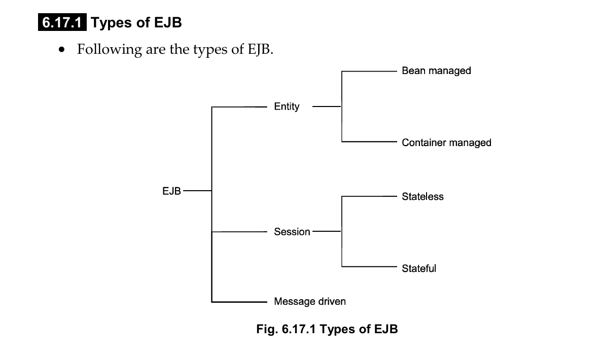
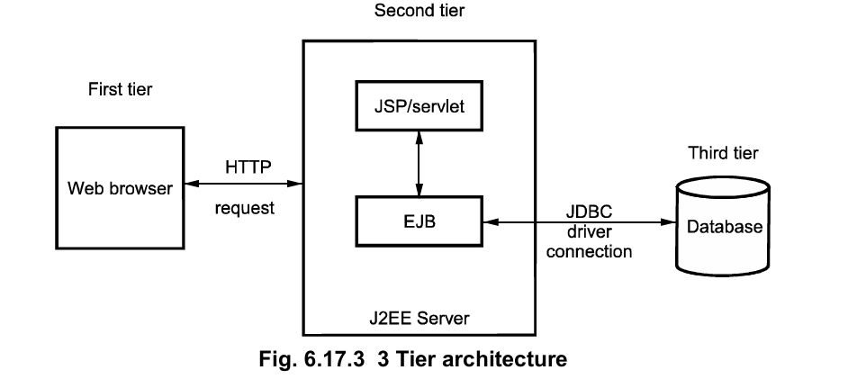

1. **What is EJB? Why is it used?**
EJB, or Enterprise JavaBeans, is a server-side component architecture within the Java Platform, Enterprise Edition (Java EE) framework. 
J2EE application container contains the components that can be used by the clients for executing the business logic. These components are known as Enterprise Java Beans (EJB).
---
2. **What are the different types of EJB?**



**In EJB, there are three main types of Enterprise Beans:**

1. **Entity Beans** (deprecated in EJB 3.x)
2. **Session Beans**
3. **Message-Driven Beans**

### 1. **Entity Beans** (used in earlier versions like EJB 2.x):

Entity Beans represent **persistent data stored in a database**. Each instance corresponds to a row in a database table.

There are two types of Entity Beans:

#### a) **Bean-Managed Persistence (BMP):**

* The developer writes the code to manage the database operations (`insert`, `update`, etc.).
* More flexible but more complex to maintain.

#### b) **Container-Managed Persistence (CMP):**

* The EJB container automatically handles all the database interaction.
* The developer just defines mappings, and the container handles SQL behind the scenes.

> **Note:** Entity Beans were replaced by **JPA (Java Persistence API)** in EJB 3.0, which is much easier to use.


### 2. **Session Beans**:

Session beans are used to **perform business logic**. They are **not persistent**, meaning their state is not stored in a database unless done explicitly.

There are two main types:

#### a) **Stateful Session Bean:**

* Maintains the state for a specific client.
* Ideal for situations like a shopping cart or online booking system.

#### b) **Stateless Session Bean:**

* Does **not** maintain any client state between calls.
* Suitable for tasks like user authentication or sending emails.

---

### 3. **Message-Driven Beans (MDB):**

* They process **asynchronous messages**, usually from a **JMS (Java Message Service)** queue.
* They are similar to event listeners and are **stateless**.
* Used in cases like order processing, email sending, background jobs, etc.

---

### Summary Table:

| Bean Type         | Purpose                          | State | Example Use Case                   |
| ----------------- | -------------------------------- | ----- | ---------------------------------- |
| Entity Bean       | Persistent data (DB row)         | Yes   | Customer or Product entity         |
| Stateful Session  | Business logic + remembers state | Yes   | Shopping cart, user session        |
| Stateless Session | Business logic only              | No    | Login service, send email          |
| Message-Driven    | Async message processing         | No    | Process order queue asynchronously |


---
3. **What is the difference between Stateless and Stateful Session Beans?**

| Feature          | Stateless Session Bean       | Stateful Session Bean                          |
| ---------------- | ---------------------------- | ---------------------------------------------- |
| State Management | Does not keep client state   | Maintains state for a specific client          |
| Use Case         | For independent operations   | For multi-step processes (e.g., shopping cart) |
| Performance      | More scalable, reused freely | Less scalable, tied to client session          |
| Example          | Login validation             | Online shopping session                        |

---
4. **What is a Message-Driven Bean?**
A Message-Driven Bean (MDB) is a special type of EJB that acts as a JMS message listener. It receives and processes messages asynchronously from a queue or topic. MDBs are stateless and are used in situations like email notification services or order processing systems.

---
5. **What is the EJB container?**
The EJB container is part of the application server that manages the lifecycle of EJBs. It provides system-level services like:

- Transaction management
- Security
- Remote access
- Concurrency control

The container frees the developer from writing boilerplate code and ensures that the EJB runs in a controlled environment.

---
6. **What is Remote and Local Interface?**

In EJB, **interfaces** define how clients interact with enterprise beans. Depending on where the client is located (same JVM or different JVM), we use **Local** or **Remote** interfaces.

---

### 🔹 **Remote Interface**

* A **Remote Interface** is used when the client accessing the EJB is in a **different JVM or on a different machine**.
* It allows **remote method invocation** using RMI (Remote Method Invocation).
* Requires all method parameters and return types to be **serializable**.

#### Example:

```java
import javax.ejb.Remote;

@Remote
public interface MyRemoteService {
    String getData();
}
```

> Annotate your bean with `@Remote` to expose it as a remote interface.

---

### 🔹 **Local Interface**

* A **Local Interface** is used when the client and the bean are in the **same JVM** (like inside the same web application).
* It's **faster** because it avoids the overhead of remote communication.
* Method parameters do not need to be serializable.

#### Example:

```java
import javax.ejb.Local;

@Local
public interface MyLocalService {
    String getLocalData();
}
```
---
7. **What is `@Stateless`, `@Stateful`, and `@MessageDriven`?**

### **What is `@Stateless`, `@Stateful`, and `@MessageDriven`?**

These are **annotations** in EJB that define the type of EJB bean being used. They specify the **behavior** of the bean in terms of state management and how the bean interacts with clients.

### 🔹 **`@Stateless`** (Stateless Session Bean)

* **Definition**: The `@Stateless` annotation is used to declare a **Stateless Session Bean**. A stateless bean does **not** maintain any state between method invocations.
* **Behavior**: Each method call is **independent** of the previous ones, and the bean instance can be reused by different clients.
* **Use Case**: Suitable for scenarios where there is no need to maintain any client-specific data between requests (e.g., authentication services, business logic processing).

#### Example:

```java
import javax.ejb.Stateless;

@Stateless
public class MyStatelessService {
    public String processData(String data) {
        return "Processed: " + data;
    }
}
```

* **Key Point**: Stateless beans are **scalable** because the container can reuse instances to serve multiple clients.

### **`@Stateful`** (Stateful Session Bean)

* **Definition**: The `@Stateful` annotation is used to define a **Stateful Session Bean**. A stateful bean **maintains state** between method calls for a specific client.
* **Behavior**: The state is preserved across multiple method calls for the same client, making it suitable for handling **conversations** or **user sessions**.
* **Use Case**: Ideal for applications where the user's state needs to be preserved between requests, such as shopping carts or multi-step wizards.

#### Example:

```java
import javax.ejb.Stateful;

@Stateful
public class ShoppingCartBean {
    private List<String> cartItems = new ArrayList<>();

    public void addItem(String item) {
        cartItems.add(item);
    }

    public List<String> getCartItems() {
        return cartItems;
    }
}
```

* **Key Point**: Stateful beans are **less scalable** because the container needs to maintain the client-specific state.

### **`@MessageDriven`** (Message-Driven Bean)

* **Definition**: The `@MessageDriven` annotation is used to define a **Message-Driven Bean (MDB)**. MDBs are designed to **consume and process asynchronous messages** (usually from a JMS queue or topic).
* **Behavior**: MDBs do not have a client interface. Instead, they are **event-driven** and act as message listeners.
* **Use Case**: Ideal for background processing, asynchronous tasks, or handling messages like orders in a queue, email notifications, etc.

#### Example:

```java
import javax.ejb.MessageDriven;
import javax.jms.Message;
import javax.jms.MessageListener;

@MessageDriven
public class OrderProcessorMDB implements MessageListener {
    public void onMessage(Message message) {
        // Process the message (e.g., an order placed in a queue)
        System.out.println("Processing order: " + message);
    }
}
```

* **Key Point**: MDBs are **stateless** and handle **asynchronous communication**.

### **Summary Table:**

| Annotation       | Bean Type                 | State Management                 | Use Case Example                                    |
| ---------------- | ------------------------- | -------------------------------- | --------------------------------------------------- |
| `@Stateless`     | Stateless Session Bean    | No state between method calls    | Authentication service, Business logic processing   |
| `@Stateful`      | Stateful Session Bean     | Maintains client-specific state  | Shopping cart, multi-step forms                     |
| `@MessageDriven` | Message-Driven Bean (MDB) | No state, asynchronous messaging | Processing JMS messages (e.g., email, order queues) |

### **Conclusion:**

* **`@Stateless`**: For beans that don’t require state persistence.
* **`@Stateful`**: For beans that need to retain state across multiple method calls.
* **`@MessageDriven`**: For beans that handle asynchronous messages.

---
8. **Architecture of EJB**



1. The client is working on a web browser. 
2. There is a database server that hosts a database, like MySQL / Oracle. 
3. The J2EE server machine is running on an application server. 
4. The client interface is provided with JSP / Servlet. The enterprise beans reside in the business tier providing to the client tier. 
5. The Application Server manages the relationships between the client and database machines. 

---
9. **Sample Example of EJB**

Here is a simple example showing how a **Servlet** can act as a client to a **Stateless EJB** in a **web application**:

### 1. **EJB (Stateless Session Bean)**

The **Stateless Session Bean** from the previous example:

```java
import javax.ejb.Stateless;

@Stateless
public class GreetingServiceBean implements GreetingServiceRemote {
    @Override
    public String sayHello(String name) {
        return "Hello, " + name + "!";
    }
}
```

### 2. **Remote Interface**

The **remote interface** for the EJB:

```java
import javax.ejb.Remote;

@Remote
public interface GreetingServiceRemote {
    String sayHello(String name);
}
```

---

### 3. **Servlet Client**

Now, let's create a **Servlet** that interacts with the `GreetingServiceBean` using **JNDI lookup**.

```java
import javax.servlet.*;
import javax.servlet.http.*;
import javax.naming.Context;
import javax.naming.InitialContext;
import javax.naming.NamingException;
import java.io.IOException;

public class GreetingServlet extends HttpServlet {

    private GreetingServiceRemote greetingService;

    @Override
    public void init() throws ServletException {
        super.init();
        try {
            // Set up JNDI context for lookup
            Context context = new InitialContext();
            // Lookup the remote EJB using JNDI
            greetingService = (GreetingServiceRemote) context.lookup("java:global/your-web-app/GreetingServiceBean!com.example.GreetingServiceRemote");
        } catch (NamingException e) {
            e.printStackTrace();
            throw new ServletException("EJB lookup failed", e);
        }
    }

    @Override
    protected void doGet(HttpServletRequest request, HttpServletResponse response) throws ServletException, IOException {
        String name = request.getParameter("name");
        if (name == null) {
            name = "Guest";
        }

        // Call the EJB method
        String greeting = greetingService.sayHello(name);

        // Send the result as the HTTP response
        response.setContentType("text/html");
        response.getWriter().println("<html><body>");
        response.getWriter().println("<h1>" + greeting + "</h1>");
        response.getWriter().println("</body></html>");
    }
}
```

### 4. **web.xml Configuration**

You need to configure the **Servlet** in the `web.xml` file of your web application.

```xml
<web-app xmlns="http://java.sun.com/xml/ns/javaee" xmlns:xsi="http://www.w3.org/2001/XMLSchema-instance" xsi:schemaLocation="http://java.sun.com/xml/ns/javaee http://java.sun.com/xml/ns/javaee/web-app_3_0.xsd" version="3.0">
    <servlet>
        <servlet-name>greetingServlet</servlet-name>
        <servlet-class>com.example.GreetingServlet</servlet-class>
    </servlet>

    <servlet-mapping>
        <servlet-name>greetingServlet</servlet-name>
        <url-pattern>/greet</url-pattern>
    </servlet-mapping>
</web-app>
```

In this case, the **Servlet** will be accessible at `/greet` in your web application. For example:

```
http://localhost:8080/your-web-app/greet?name=John
```

---

### 5. **Deploy and Run**

1. **Deploy** your **EJB module** and **web module** (if they are separate) to a Java EE application server like **WildFly**, **GlassFish**, or **Payara**.
2. **Start the server** and open your browser.
3. **Visit the servlet** URL (e.g., `http://localhost:8080/your-web-app/greet?name=John`).
4. The servlet will call the **EJB** and display the greeting message.

---

### 6. **JNDI Lookup Explanation**

The `GreetingServlet` uses **JNDI** (Java Naming and Directory Interface) to look up the remote interface of the EJB:

```java
greetingService = (GreetingServiceRemote) context.lookup("java:global/your-web-app/GreetingServiceBean!com.example.GreetingServiceRemote");
```

* **JNDI Name**: `java:global/your-web-app/GreetingServiceBean!com.example.GreetingServiceRemote`

  * `your-web-app`: The name of the web application (or module).
  * `GreetingServiceBean`: The name of the bean.
  * `com.example.GreetingServiceRemote`: The fully qualified name of the remote interface.

The `GreetingServiceRemote` interface is used by the servlet to call the business method `sayHello()`.

---

### **Summary:**

* **Servlet** acts as the **client** to invoke the **EJB**.
* **EJB** provides the business logic (in this case, a greeting message).
* **JNDI lookup** is used to access the EJB from the servlet.
* The **Stateless Session Bean** (`GreetingServiceBean`) does not maintain state and can be shared among clients.

---

