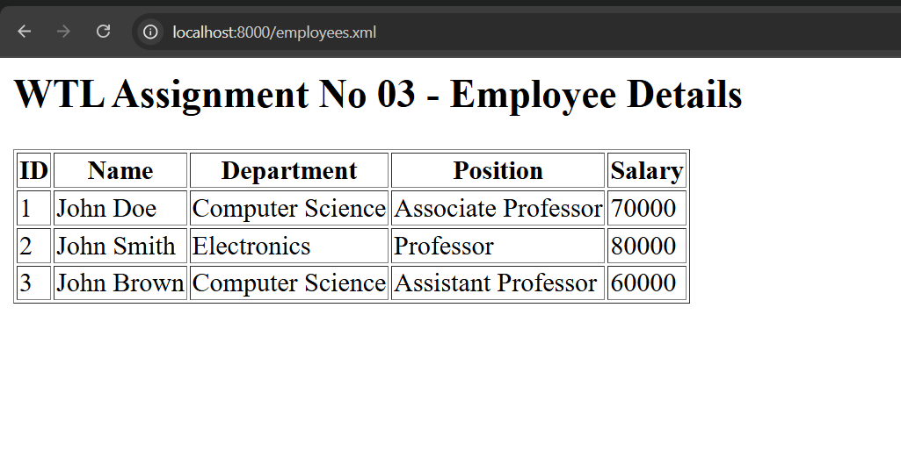

## Assignment 03

Design the XML document to store the information of the employees of any business organisation and demonstrate the use of:
a. DTD
b. XML Schema

And display the content in tabular format

### How to run

```bash
python -m http.server 8000
```

And goto `http://localhost:8000/employees.xml` on Chrome


You should see this:

