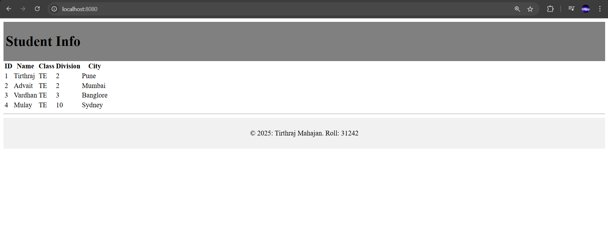
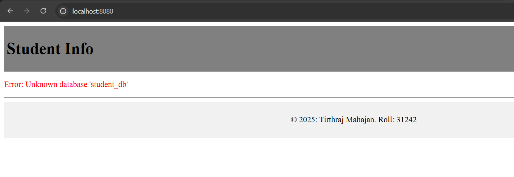

## How to run

```sql
CREATE DATABASE IF NOT EXISTS student_db;

use student_db;
CREATE TABLE students_info (
     stud_id INT PRIMARY KEY,
     stud_name VARCHAR(100),
     class VARCHAR(50),
     division VARCHAR(10),
     city VARCHAR(100)
);

INSERT INTO students_info VALUES
    (1, 'Tirthraj', 'TE', '2', 'Pune'),
    (2, 'Advait', 'TE', '2', 'Mumbai'),
    (3, 'Vardhan', 'TE', '3', 'Banglore'),
    (4, 'Mulay', 'TE', '10', 'Sydney');
```


```bash
mvn jetty:run
```

You should now see `http://localhost:8080/`




If you have a sql error, you'll get error something like this. This means that you haven't configured database connection properly

