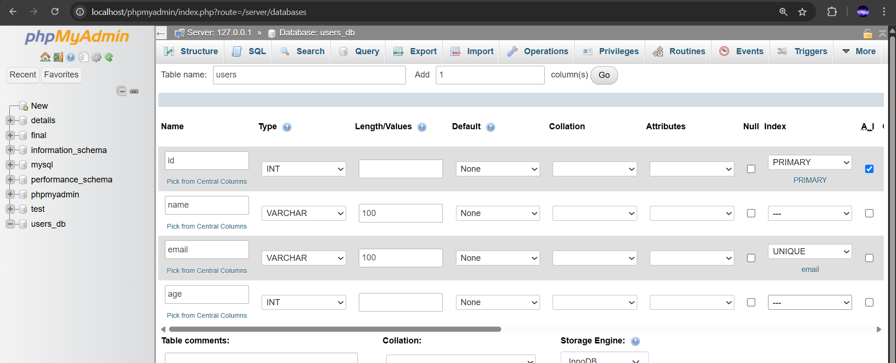
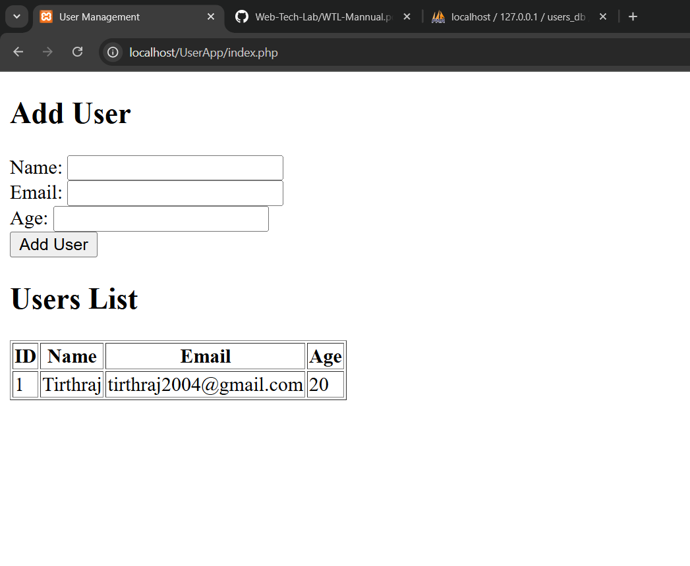

## Assignment 07 

Problem Statement   

Build a dynamic web application using PHP and MYSQL
a. Create database tables in MYSQL and create a connection with PHP
b. Create the add, update and retrieve functions in PHP web app interating with MySQL database


Database Schema:

```sql
CREATE DATABASE IF NOT EXISTS users_db;
USE users_db;

CREATE TABLE IF NOT EXISTS users (
    id INT AUTO_INCREMENT PRIMARY KEY,
    name VARCHAR(100) NOT NULL,
    email VARCHAR(100) NOT NULL,
    age INT
);
```

If you are using phpMyAdmin, create a new database and table should look something like this:



---
Output

Before:


After:
