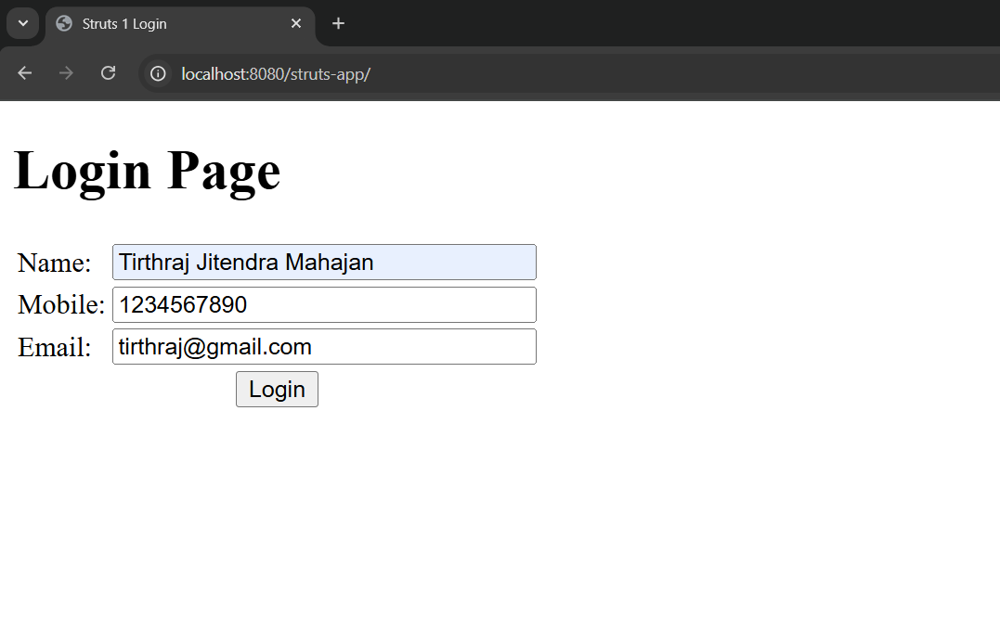
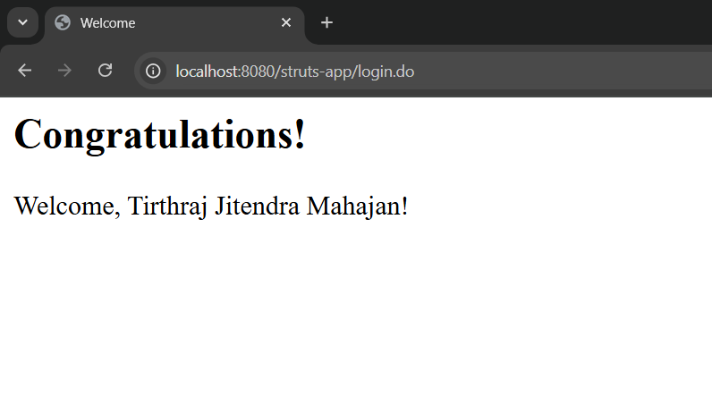
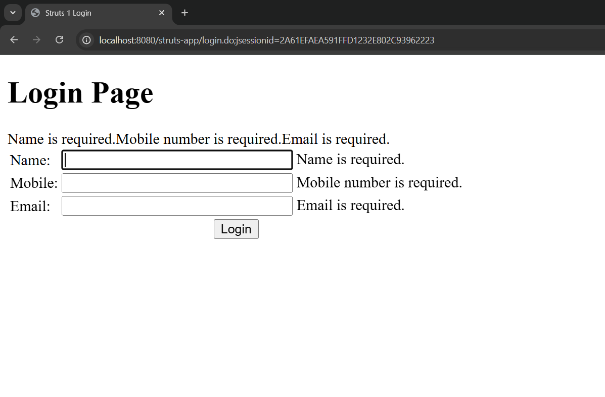

## Assignment 10 : Struts App

**Problem Statement**

Design a login page with entries for name, mobile number and email. Use Struts and perform following validation

1. Validation for correct names
2. Validation for mobile numbers 
3. Validation for emails
4. Validation if no entered value
Congratulations and welcome page on successful entries

---

How to run:

Run using the embeded Tomcat server
```bash
mvn tomcat7:run 
```

Output:


After you fill the correct information, you get to this screen


If you fill incorrect information at the start, you get this:

