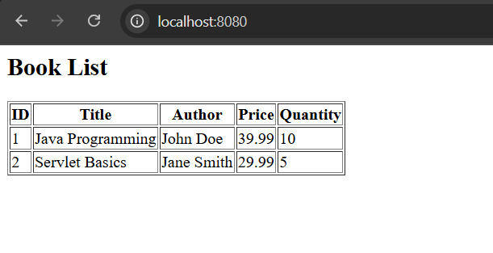

## Assignment 05
By Tirthraj Mahajan
Roll No: 31242

Problem Statement
Implement a sample program demonstrating the use of servlets. Create a database using mysql with table ebookshop (book_id, book_title, book_author, book_price, quantity) and display the table using servlet. Use jdbc for mysql connection


Step 1: Create a mysql database and create a table with few entries
```sql
CREATE DATABASE IF NOT EXISTS bookdb;

USE bookdb;

CREATE TABLE IF NOT EXISTS ebookshop (
    book_id INT PRIMARY KEY,
    book_title VARCHAR(255),
    book_author VARCHAR(255),
    book_price DOUBLE,
    quantity INT
);

INSERT INTO ebookshop VALUES
(1, 'Java Programming', 'John Doe', 39.99, 10),
(2, 'Servlet Basics', 'Jane Smith', 29.99, 5);
```

Example:

```
mysql> CREATE DATABASE IF NOT EXISTS bookdb;
Query OK, 1 row affected (0.02 sec)

mysql> use bookdb;
Database changed
mysql> CREATE TABLE IF NOT EXISTS ebookshop (
    ->     book_id INT PRIMARY KEY,
    ->     book_title VARCHAR(255),
    ->     book_author VARCHAR(255),
    ->     book_price DOUBLE,
    ->     quantity INT
    -> );
Query OK, 0 rows affected (0.03 sec)

mysql> INSERT INTO ebookshop VALUES
    -> (1, 'Java Programming', 'John Doe', 39.99, 10),
    -> (2, 'Servlet Basics', 'Jane Smith', 29.99, 5);
Query OK, 2 rows affected (0.02 sec)
Records: 2  Duplicates: 0  Warnings: 0
```
---

Step 2: Add JDBC Driver to Maven

In your pom.xml, add the MySQL JDBC driver

```xml
<dependency>
    <groupId>mysql</groupId>
    <artifactId>mysql-connector-java</artifactId>
    <version>8.0.33</version>
</dependency>
```
---

## How to run

```bash
mvn jetty:run
```

You should now see `http://localhost:8080/`

 
