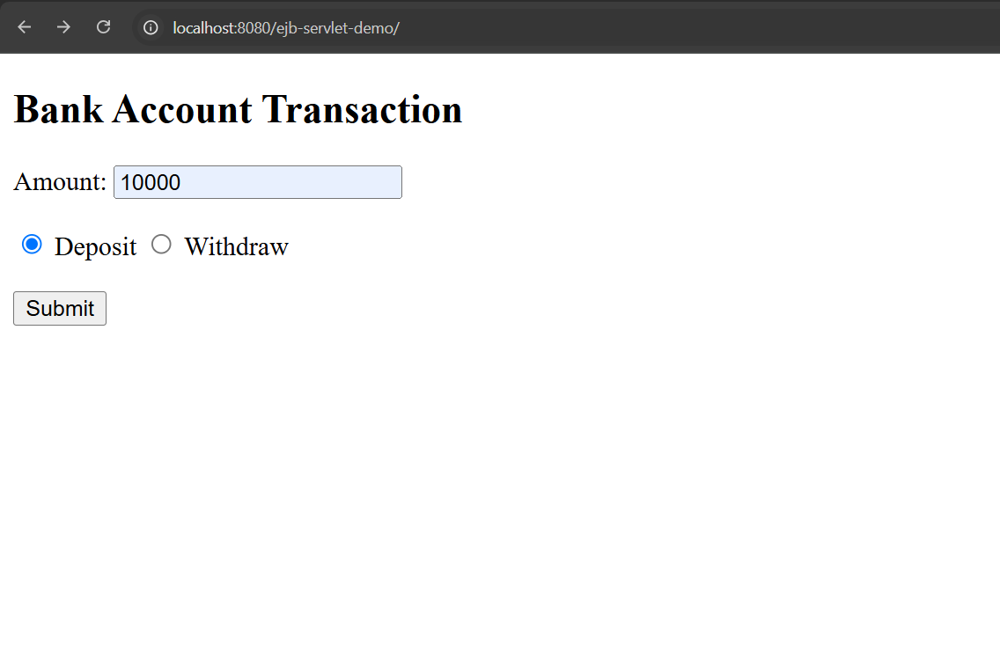
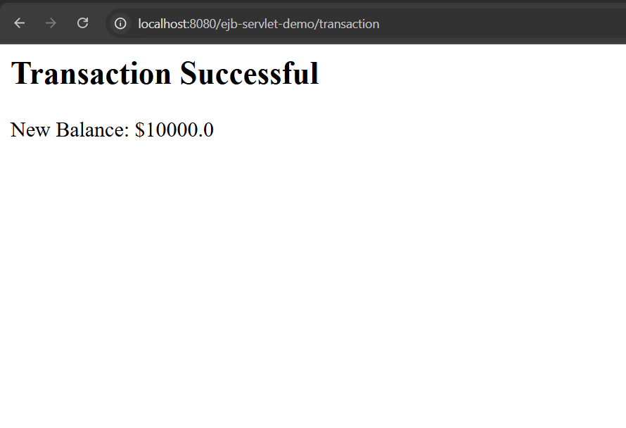
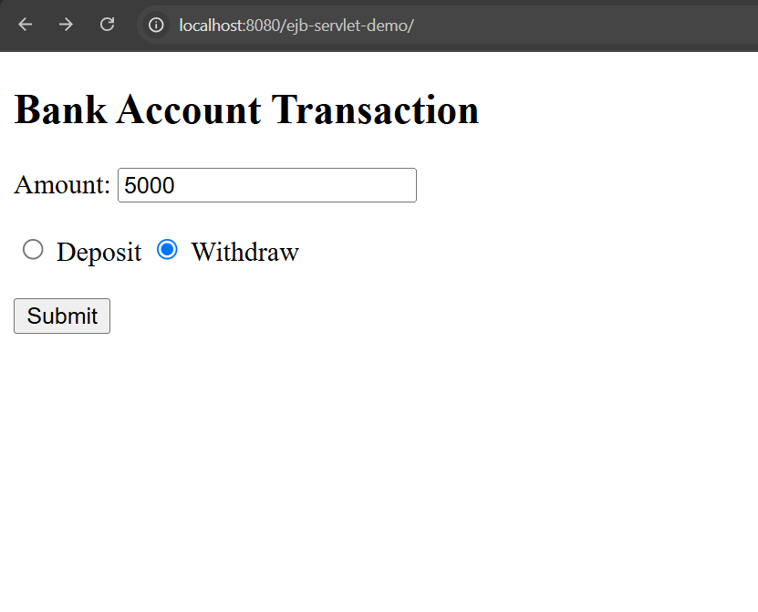
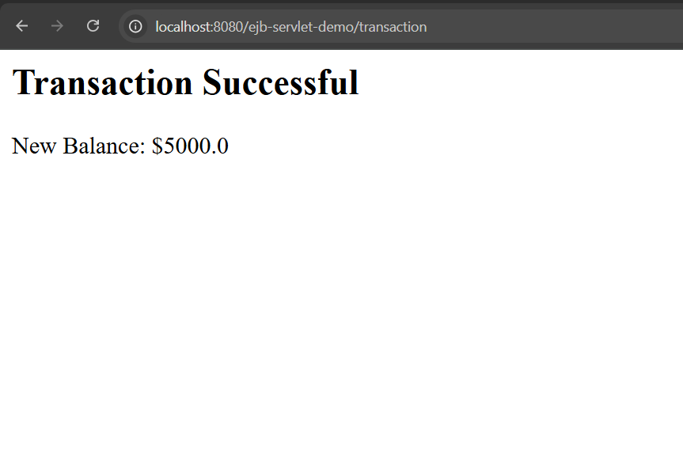
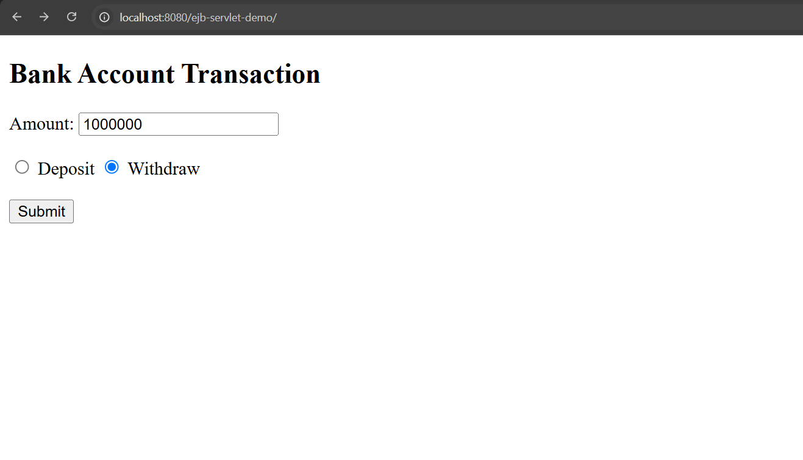
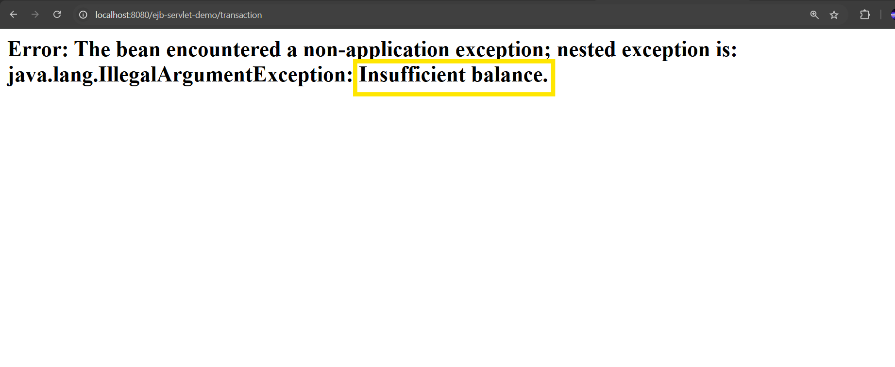

## Assignment 10
By Tirthraj Mahajan
Roll No: 31242

Problem Statement  
Design and implement the web application logic for deposit and withdraw amount transaction using EJB

### How to run

```bash
mvn clean package
```

Run the embedded Tomcat server
```bash
mvn tomee-embedded:run 
```

Here's the output:   

**Deposit 10k in account**  


**Success page:**   

---
**Withdraw 5k from account**   


**Success page:**  

---
**Withdraw 1000000 from account**


**Insufficient Funds error**   

