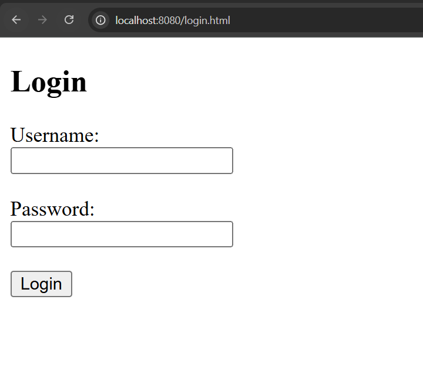
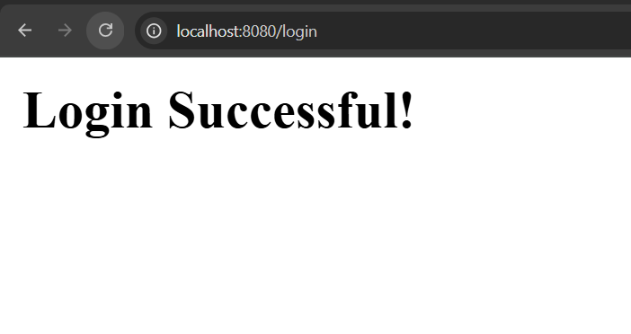

## How to run

```sql
CREATE DATABASE servlet_example_2;
use servlet_example_2;

CREATE TABLE users (
    ID INT PRIMARY KEY,
    name VARCHAR(255),
    password VARCHAR(255)
);

INSERT INTO users VALUES (1, 'tirthraj', 'tirthraj07');
INSERT INTO users VALUES (2, 'vartak', 'proteinpowergoesbrrr');
INSERT INTO users VALUES (3, 'harshb', 'chotubadmash');
```


```bash
mvn jetty:run
```

Now goto `http://localhost:8080/login.html`
You'll see:


Enter the credentials : `tirthraj` and `tirthraj07`, you'll see
