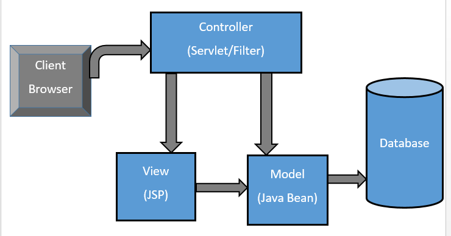

## How to run

```bash
mvn jetty:run
```

You should now see `http://localhost:8080/`


After you click the login button


## Diagram of the entire code for your understanding



Here, since we are using sessions, you can interpret the database as in memory-storage
`scope="session"`