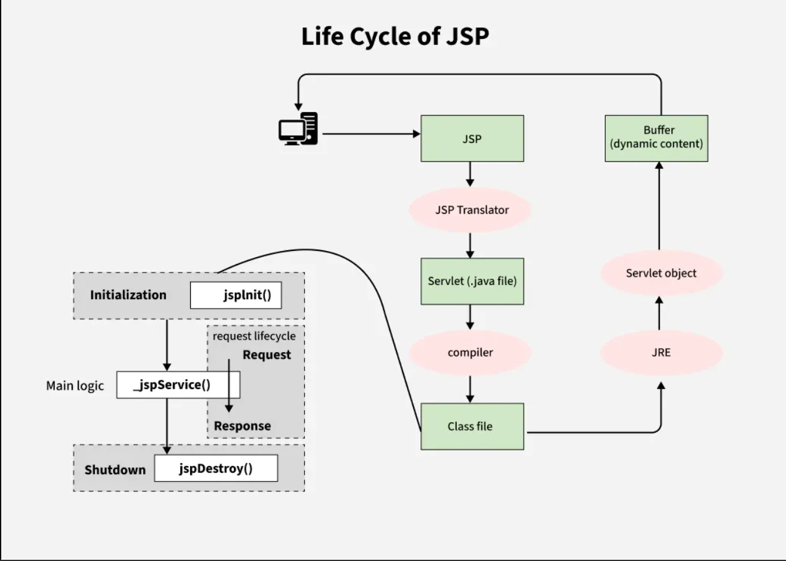

## Q. What is JSP?
JSP (JavaServer Pages) is a server-side technology used to create dynamic, platform-independent web content. It's a part of the Java EE (Jakarta EE) platform and allows you to embed Java code directly into HTML pages.

Jsp is the extension of Servlet Technology, but it provides more functionality than Servlet

```jsp
<!-- welcome.jsp -->
<html>
  <body>
    <h1>Welcome!</h1>
    <p>Current time is: <%= new java.util.Date() %></p>
  </body>
</html>
```

Goto `JSP Example 1` in the Repository

---

## Q: What are the various element of JSP page? 

JSP pages consist of several **elements** that allow you to embed Java logic, define reusable code, control output, and manage structure. Each type of element serves a different purpose in the page.


| Element Type              | Syntax                     | Purpose                                                |
| ------------------------- | -------------------------- | ------------------------------------------------------ |
| 1. **Directives**         | `<%@ ... %>`               | Provide global info (e.g., page config, imports)       |
| 2. **Scriptlets**         | `<% Java code %>`          | Embed Java code blocks into the JSP                    |
| 3. **Expressions**        | `<%= expression %>`        | Output the result of a Java expression                 |
| 4. **Declarations**       | `<%! Java declaration %>`  | Declare variables/methods at class level               |
| 5. **Comments**           | `<%-- comment --%>`        | JSP-specific comments (not shown in HTML output)       |
| 6. **Standard Actions**   | `<jsp:... />`              | Invoke built-in functionality (e.g., include, useBean) |
| 7. **Custom Tags (JSTL)** | `<c:...>` or `<mytag:...>` | Abstract and simplify logic using tag libraries        |

---

### 🔍 1. **Directives**

Tell the container how to process the JSP page.

```jsp
<%@ page import="java.util.Date" %>
<%@ page contentType="text/html" %>
<%@ include file="header.jsp" %>
```


### 🔍 2. **Scriptlets**

Embed raw Java code (avoid in modern JSPs).

```jsp
<%
  int x = 10;
  String name = "User";
%>
```


### 🔍 3. **Expressions**

Output Java values directly into HTML.

```jsp
<p>Today is: <%= new Date() %></p>
```


### 🔍 4. **Declarations**

Define variables or methods at the class level (used across requests).

```jsp
<%! 
  int counter = 0;
  public int getCounter() { return counter++; }
%>
```


### 🔍 5. **JSP Comments**

Not visible in client view source (unlike HTML comments).

```jsp
<%-- This comment won't appear in the output HTML --%>
```


### 🔍 6. **Standard Actions**

Special tags to perform operations like including files or working with JavaBeans.

```jsp
<jsp:include page="footer.jsp" />
<jsp:useBean id="user" class="com.example.User" scope="session" />
<jsp:setProperty name="user" property="*" />
```
---

## Q: Write a JSP Page that includes all the JSP Tags

Go checkout `JSP Example 2` in the Repository

---

## Q: Write a JSP scriptlet for displaying even numbers between 1 to 50

Go checkout `JSP Example 2` in the Repository

---

## Q: Create simple JSP pages which will explain use implicit session object of JSP. 

Go checkout `JSP Example 3` in the Repository (Contains FLOWCHART for better understanding)

---

## Q: What are JSP Implicit Objects and List and elaborate any five JSP implicit objects with examples.  

JSP Implicit Objects are predefined objects created by the JSP container that can be used directly in JSP pages without declaring or instantiating them. They provide access to important servlet and application-level information like requests, responses, sessions, and more

| Implicit Object | Class                 | Scope             | Description                                       |
| --------------- | --------------------- | ----------------- | ------------------------------------------------- |
| `request`       | `HttpServletRequest`  | Request scope     | Represents the client's request data              |
| `response`      | `HttpServletResponse` | Request scope     | Used to modify the HTTP response                  |
| `session`       | `HttpSession`         | Session scope     | Manages data for a user session                   |
| `application`   | `ServletContext`      | Application scope | Stores global app-level data                      |
| `out`           | `JspWriter`           | Page scope        | Sends output to the browser                       |
| `config`        | `ServletConfig`       | Page scope        | Contains servlet configuration info               |
| `pageContext`   | `PageContext`         | Page scope        | Gives access to all the implicit objects          |
| `page`          | `Object` (this)       | Page scope        | Refers to the current JSP page (like `this`)      |
| `exception`     | `Throwable`           | Error page only   | Refers to uncaught exception (only in error page) |


### 1. `request` — (`HttpServletRequest`)

* Represents the **HTTP request** sent by the client (browser).
* Used to fetch **form data**, headers, parameters, etc.

#### Example:

```jsp
<%
  String username = request.getParameter("uname");
  out.println("Welcome " + username);
%>
```

### 2. `response` — (`HttpServletResponse`)

* Represents the **HTTP response** sent to the client.
* Used to set response headers, send redirects, change content type, etc.

#### Example:

```jsp
<%
  response.setContentType("text/html");
  if(request.getParameter("uname") == null) {
    response.sendRedirect("login.html");
  }
%>
```

### 3. `session` — (`HttpSession`)

* Used to store **user-specific data** between multiple requests.
* Helpful for login, shopping cart, and other session-tracking features.

#### Example:

```jsp
<%
  session.setAttribute("username", "JohnDoe");
  String user = (String) session.getAttribute("username");
  out.print("Session User: " + user);
%>
```

### 4. `application` — (`ServletContext`)

* Shared object for the **entire application**.
* Stores global data (accessible to all users and pages).

#### Example:

```jsp
<%
  application.setAttribute("appName", "My Web App");
  out.println("App Name: " + application.getAttribute("appName"));
%>
```

### 5. `out` — (`JspWriter`)

* Used to send **output to the client** (browser).
* Similar to `System.out` but for HTML content.

#### Example:

```jsp
<%
  out.println("<h3>Hello, JSP!</h3>");
%>
```

### 6. `exception` — (`Throwable`)

* Only available in a JSP page that has `isErrorPage="true"` set.
* Used to handle and display unhandled exceptions.

#### Example:

```jsp
<%@ page isErrorPage="true" %>
<html>
  <body>
    <h2>Error Occurred</h2>
    <p>Error: <%= exception.getMessage() %></p>
  </body>
</html>
```

---

## Q: What are JSP Actions? List and elaborate any five JSP actions with example.

### ✅ What Are JSP Actions?

**JSP Actions** are special XML-like tags in JavaServer Pages that control the **behavior of the servlet engine** at runtime. They enable dynamic functionality such as including other resources, forwarding requests, interacting with JavaBeans, or managing properties.

| JSP Action          | Description                                               |
| ------------------- | --------------------------------------------------------- |
| `<jsp:include>`     | Includes another resource dynamically at request time     |
| `<jsp:forward>`     | Forwards request to another resource (JSP/Servlet)        |
| `<jsp:param>`       | Passes parameters with `<jsp:include>` or `<jsp:forward>` |
| `<jsp:useBean>`     | Declares or accesses a JavaBean                           |
| `<jsp:setProperty>` | Sets a JavaBean property                                  |
| `<jsp:getProperty>` | Retrieves a JavaBean property                             |
| `<jsp:plugin>`      | Embeds a Java applet in the page                          |


Examples:

1. `<jsp:include>` — Dynamic Include
Purpose: Includes a file at request time (unlike `<%@ include ... %>` which works at compile time).
Use: When the included file can change dynamically or depends on request parameters.

```jsp
<jsp:include page="header.jsp" />
```

2. `<jsp:forward>` — Forward Request
Forwards the request from one JSP/Servlet to another resource (JSP, HTML, Servlet).

<jsp:forward page="login.jsp" />

Example
```jsp
<%
    if(session.getAttribute("user") == null){
%>
    <jsp:forward page="login.jsp" />
<%
    }
%>
```

3. `<jsp:param>` — Parameter Passing
Used inside <jsp:include> or <jsp:forward> to pass parameters.

```jsp
<jsp:include page="profile.jsp">
    <jsp:param name="username" value="john_doe" />
</jsp:include>
```

4. `<jsp:useBean>` — Declare and Instantiate JavaBean  
Loads a JavaBean for use in a JSP page.

```jsp
<jsp:useBean id="user" class="com.example.User" scope="session" />
```

5. `<jsp:setProperty>` and `<jsp:getProperty>` — Bean Property Access

```jsp
<jsp:setProperty name="user" property="email" value="alice@example.com" />
<p>Email: <jsp:getProperty name="user" property="email" /></p>
```

---

## Q: Explain error handling in JSP with example

JSP provides a way to handle errors gracefully using **error pages** 

#### **Using `isErrorPage` and `errorPage` Directives**  

* You define a page as an **error page** using:

  ```jsp
  <%@ page isErrorPage="true" %>
  ```
* In the page where an error might occur, specify:

  ```jsp
  <%@ page errorPage="error.jsp" %>
  ```


#### 🔸 `index.jsp` — Main Page

```jsp
<%@ page errorPage="error.jsp" %>
<html>
<body>
    <%
        int a = 10;
        int b = 0;  // This will cause an exception
        int result = a / b; // Division by zero
    %>
    <p>Result: <%= result %></p>
</body>
</html>
```

#### 🔸 `error.jsp` — Error Page

```jsp
<%@ page isErrorPage="true" %>
<html>
<body>
    <h2 style="color:red;">An error occurred!</h2>
    <p>Error Message: <%= exception.getMessage() %></p>
</body>
</html>
```

---

## Q: What is difference between include action and include directive in JSP? 

### 1. `<%@ include file="..." %>` — **Include Directive (Static Include)**

**Example:**

```jsp
<%@ include file="header.jsp" %>
```

### 2. `<jsp:include page="..." />` — **Include Action (Dynamic Include)**

**Example:**

```jsp
<jsp:include page="header.jsp" />
```

With parameters:

```jsp
<jsp:include page="user.jsp">
  <jsp:param name="username" value="Alice" />
</jsp:include>
```

| Feature             | `<%@ include %>`         | `<jsp:include>` |
| ------------------- | ------------------------ | --------------- |
| Type                | Static                   | Dynamic         |
| Inclusion Time      | Compile-time             | Runtime         |
| Reflects Changes    | Only after recompilation | Immediately     |
| Can Pass Parameters | ❌ No                     | ✅ Yes           |
| Use Case            | Layout fragments         | Dynamic content |

---
## Q: Explain error handling in JSP with example using JSP Actions

JSP provides a way to handle errors using JSP actions like <jsp:forward> to redirect on specific conditions.

* You check for error conditions and use:

  ```jsp
  <jsp:forward page="error.jsp" />
  ```
* Can be paired with `<jsp:param>` to pass error messages.

### Example Using `<jsp:forward>` for Manual Error Redirection

#### 🔸 `calculate.jsp`

```jsp
<%
    String num1 = request.getParameter("num1");
    String num2 = request.getParameter("num2");

    if(num2 != null && num2.equals("0")) {
%>
    <jsp:forward page="error.jsp">
        <jsp:param name="message" value="Cannot divide by zero!" />
    </jsp:forward>
<%
    }

    int result = Integer.parseInt(num1) / Integer.parseInt(num2);
%>
<p>Result: <%= result %></p>
```

#### 🔸 `error.jsp` (for forwarding)

```jsp
<html>
<body>
    <h2>Error Occurred</h2>
    <p><%= request.getParameter("message") %></p>
</body>
</html>
```
---

## Q: How do you define application wide error page in JSP?

### ✅ How to Define an **Application-Wide Error Page** in JSP

To handle exceptions globally in your entire JSP-based web application, you can define an **application-wide error page** using the **`web.xml`** deployment descriptor. This ensures all unhandled exceptions or HTTP errors are caught and redirected to a custom error JSP page.

#### 1. **Create the Error Page (`error.jsp`)**

```jsp
<%@ page isErrorPage="true" %>
<html>
  <body>
    <h2 style="color:red;">Oops! Something went wrong.</h2>
    <p>Error Message: <%= exception.getMessage() %></p>
  </body>
</html>
```

> `isErrorPage="true"` allows access to the implicit `exception` object.

---

#### 2. **Configure `web.xml` to Set the Error Page**

```xml
<web-app xmlns="http://java.sun.com/xml/ns/javaee" version="3.0">

  <!-- General Exception Handling -->
  <error-page>
    <exception-type>java.lang.Throwable</exception-type>
    <location>/error.jsp</location>
  </error-page>

  <!-- Optional: Handle 404 Page Not Found -->
  <error-page>
    <error-code>404</error-code>
    <location>/error.jsp</location>
  </error-page>

</web-app>
```

---

## Why session management is required in JSP?

The HTTP protocol is stateless, which means:
- Each request from a browser is independent.
- The server does not remember who sent a previous request.

This creates a problem for dynamic web applications where:
- Users log in.
- Add items to a cart.
- Browse multiple pages with personalized content.

In JSP, session management can be done using:
- session implicit object (default HttpSession)
- Cookies
- URL rewriting
- Hidden form fields

### Examples:
1. session implicit object

```jsp
<%
// Save user to session
session.setAttribute("user", "Alice");

// Retrieve it later
String user = (String) session.getAttribute("user");
%>
```

2. Cookies
Sets a cookie:
```jsp
<%
    Cookie userCookie = new Cookie("username", "Alice");
    userCookie.setMaxAge(60 * 60); // 1 hour
    response.addCookie(userCookie);
%>
<p>Cookie set! <a href="readCookie.jsp">Go to next page</a></p>
````

Reads a cookie:
```jsp
<%
  Cookie[] cookies = request.getCookies();
  String name = "Guest";

  if(cookies != null){
      for(Cookie c : cookies){
          if(c.getName().equals("username")){
              name = c.getValue();
          }
      }
  }
%>
<h3>Welcome, <%= name %></h3>
```

3. URL Rewriting
login.jsp – Takes name input and redirects with URL parameter:
```jsp
<form action="home.jsp" method="get">
    Enter your name: <input type="text" name="user">
    <input type="submit" value="Login">
</form>
```
home.jsp – Retrieves value from URL:
```jsp
<%
    String user = request.getParameter("user");
%>
<h3>Welcome, <%= user %>!</h3>
<a href="logout.jsp?user=<%= user %>">Logout</a>
```

4. Hidden Form Fields
Store data in HTML form fields and pass it with each POST request.

`step1.jsp` – First page:
```jsp
<form action="step2.jsp" method="post">
    Enter your name: <input type="text" name="user">
    <input type="submit" value="Next">
</form>
```

`step2.jsp` – Next page with hidden field:
```jsp
<%
    String user = request.getParameter("user");
%>
<form action="welcome.jsp" method="post">
    <input type="hidden" name="user" value="<%= user %>">
    Enter your city: <input type="text" name="city">
    <input type="submit" value="Submit">
</form>
```

`welcome.jsp` – Final output:
```jsp
<%
    String user = request.getParameter("user");
    String city = request.getParameter("city");
%>
<h3>Hello <%= user %> from <%= city %>!</h3>
```

---
## Q: Discuss MVC Architecture in Detail

Sure! Let’s break down the **MVC architecture** in detail, especially as it applies to **Java web applications** using technologies like **Servlets, JSP, and JavaBeans**.

---

## 🧠 What is MVC?

**MVC (Model-View-Controller)** is a **design pattern** used to **separate concerns** in software applications:

* **Model** – Handles data and business logic.
* **View** – Handles user interface.
* **Controller** – Handles user requests and application flow.

## Components of MVC (in Java Web Apps)

### Model

* Contains **business logic** and **data access logic**.
* Usually implemented with **JavaBeans**, **POJOs**, **JDBC**, **Hibernate**, etc.
* It **does not interact with UI** directly.

**Example:**

```java
public class Student {
    private String name;
    private int roll;

    // Getters and setters
}
```

---

### View

* Represents the **presentation layer**.
* Usually implemented with **JSP pages**.
* Displays data received from the controller.
* Should not contain complex logic (only display logic).

**Example (`student.jsp`):**

```jsp
<h2>Welcome, <%= request.getAttribute("name") %>!</h2>
```

---

### Controller

* Acts as the **bridge** between the View and Model.
* Handles **requests**, calls the appropriate model methods, and forwards responses to the view.
* Usually implemented using **Servlets**.

**Example (`StudentController.java`):**

```java
String name = request.getParameter("name");
Student student = new Student();
student.setName(name);
request.setAttribute("name", student.getName());
request.getRequestDispatcher("student.jsp").forward(request, response);
```

## Technologies in Java MVC (Typical Setup)

| Layer      | Technologies               |
| ---------- | -------------------------- |
| Model      | JavaBeans, JDBC, Hibernate |
| View       | JSP, JSTL, HTML, CSS       |
| Controller | Servlets                   |


---

## Q: Full Example of MVC: JSP + JavaBean + Servlets

Checkout `JSP Example 4` for JSP + JavaBean + Servlets Example.

---

## Scope attribute in Java Beans

In JSP, the `scope` attribute of the `<jsp:useBean>` tag defines **where the bean is stored** and **how long it lives**. It determines **how accessible** the bean is across different parts of your application.

### Valid Values for `scope`:

| Scope         | Description                                                           | Lives Until…                  | Available In…                     |
| ------------- | --------------------------------------------------------------------- | ----------------------------- | --------------------------------- |
| `page`        | Default scope. Bean is accessible only in the **current JSP page**.   | End of the page execution     | Current JSP                       |
| `request`     | Bean is accessible in the **current request**. Useful for forwarding. | End of request                | Multiple JSPs/Servlets in request |
| `session`     | Bean is stored in the **user session**.                               | Until session ends            | All pages in user session         |
| `application` | Bean is stored in the **application context (ServletContext)**.       | Until app is stopped/reloaded | Entire web app                    |

---

### Example:

```jsp
<jsp:useBean id="student" class="com.example.Student" scope="session" />
```

This means:

* The `student` bean is created (if not already) and stored in the **user session**.
* It will be shared across multiple JSP pages and servlets until the session ends.

---

## Q: JSP Lifecycle



### **1. Translation of JSP to Servlet:**

* **First Request (or first-time access):**
  When the JSP page is requested for the first time, the **JSP container** (e.g., Tomcat, Jetty) performs **translation** of the JSP page into a **Java Servlet**. The JSP page is transformed into a **servlet class** (Java code), which is then **compiled** into a `.class` file.

**What happens during translation?**

* The JSP file is parsed.
* Directives, scriptlets, expressions, and other JSP elements are converted into Java code inside a servlet.
* This servlet is then **compiled** into a class, typically named `JspName_jsp` (e.g., `index_jsp.class`).

### **2. Servlet Creation (`jspInit()`):**

Once the JSP is translated into a servlet (for subsequent requests), **the servlet is instantiated**.

* **`jspInit()` Method**: This method is called **only once** when the servlet (created from the JSP) is loaded for the first time.

  * The container calls this method after the servlet class is instantiated, but **before** handling any client requests.
  * It is used for **initialization** tasks, such as loading resources, establishing database connections, or performing other setup tasks that are required before the JSP page can handle requests.

**What happens during `jspInit()`?**

* The container creates an instance of the generated servlet class (the one derived from the JSP).
* It invokes the **`jspInit()`** method of the servlet.
* This is where resources that are shared across multiple requests (e.g., database connections, caches) can be initialized.

### **3. Request Handling (`jspService()`):**

After the servlet (JSP) is initialized, it can start receiving requests.

* **`jspService()` Method**: This method is called for **each client request** made to the JSP page.

  * It is **equivalent to the `service()` method** in a standard servlet.
  * The **JSP container** invokes the **`jspService()`** method whenever a request for the JSP page is made.
  * In this method, the **request is processed**, and the **response is generated** based on the content in the JSP page (e.g., using Java code or HTML).

**What happens during `jspService()`?**

* The container receives the client’s request.
* The **`jspService()`** method is called to process that request.
* It generates the **dynamic content** of the JSP, typically by executing the embedded Java code in the page.
* The final content (HTML, data) is sent back to the client as a response.

In the `jspService()` method:

* The request is passed to the servlet.
* The response is generated, and any **dynamic content** (from the JSP page) is included in the response.
* This is where **scriptlets**, **expressions**, **declarations**, and **tag libraries** are processed.

### **4. Destruction of JSP (`jspDestroy()`):**

When the JSP page is **unloaded**, either because the application is stopped or the page is no longer in use, the **JSP servlet** is destroyed.

* **`jspDestroy()` Method**: This method is invoked **once** when the servlet (created from the JSP) is about to be destroyed.

  * It is typically used to **release resources** (e.g., closing database connections, freeing up memory).
  * It is similar to the `destroy()` method in standard servlets.
  * After the `jspDestroy()` method is called, the servlet instance is discarded from memory.

**What happens during `jspDestroy()`?**

* The container invokes the **`jspDestroy()`** method.
* Any **resources** like database connections, file handles, or session data that need to be cleaned up are released.
* The servlet instance is destroyed.


| **Lifecycle Step**   | **JSP Method Involved**         | **Description**                                                         |
| -------------------- | ------------------------------- | ----------------------------------------------------------------------- |
| **Translation**      | None (JSP converted to servlet) | JSP is converted into a servlet when accessed for the first time.       |
| **Initialization**   | `jspInit()`                     | Initializes the servlet (one-time setup for resources).                 |
| **Request Handling** | `jspService()`                  | Handles the request, processes dynamic content, and generates response. |
| **Destruction**      | `jspDestroy()`                  | Cleans up resources when the JSP is no longer needed.                   |

